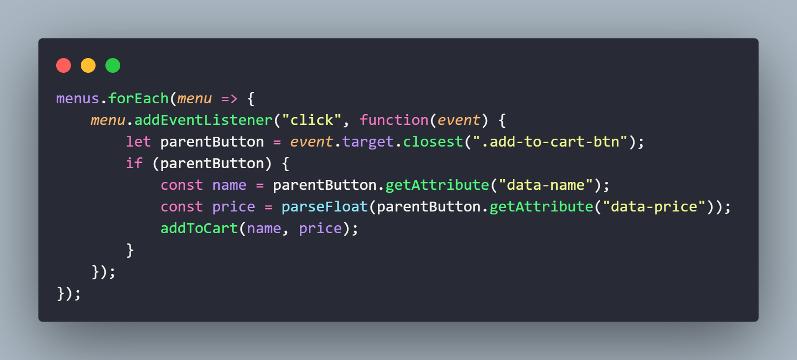
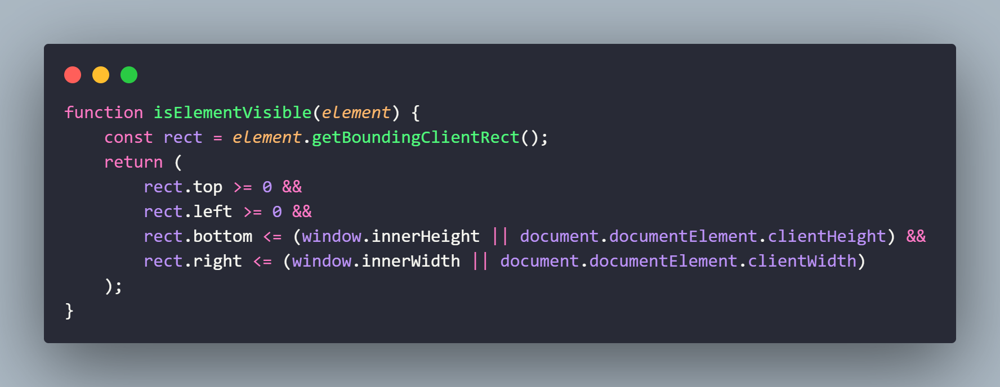
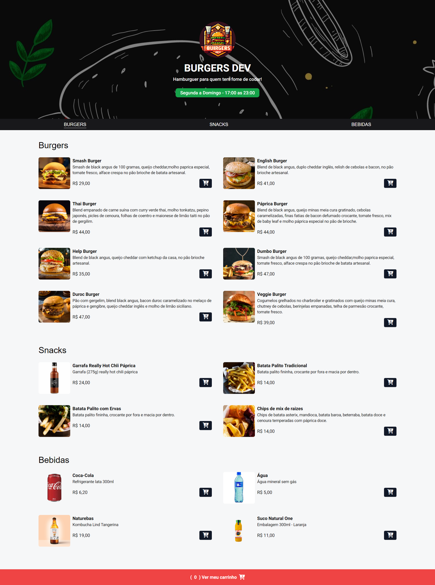

## 🏋️‍♂️ Projeto HTML + Tailwind + JavaScript.

Criação de uma site de hamburgueria.   
Os temas abordados são: 
- Manipulação do DOM.
- Manipulação de eventos.
- Atualização de elementos dinamicamente com JavaScript. 
- Alerta de tela com Toastify e validação de formulários.
- Uso do framework CSS Tailwind para estilização.
- Funções reutilizáveis. 

## Estrutura do Projeto:

- **index.html:** Arquivo HTML principal.
- **assets/**
  - **css/**
    - **styles.css:** Arquivo CSS para estilização adicional.
    - **output.css:** Arquivo CSS de saída do Tailwind.
  - **js/**
    - **script.js:** Arquivo JavaScript contendo as funcionalidades descritas acima.
    - **menu_list.js:** Arquivo JavaScript responsável por verificar visibilidade de elementos na tela e adicionar estilização.
    - **menu_itens.js:** Arquivo JavaScript responsável pela renderização dinâmica dos elementos.
- **products.json:** Arquivo JSON com dados dos produtos.

## 💻 Tecnologias utilizadas nesse projeto:

  
  
  
  

## Funcionalidades:

- Adição de itens no carrinho.
- Remoção de itens do carrinho.
- Cálculo de totais e formatação de moeda.
- Inclusão e validação dados (nome e endereço) .
- Verificação do horário de funcionamento.
- Exibição do carrinho de compras.
- Envio do pedido utilizando a API do WhatsApp.

## Resumo :

`event.target.closest`

A propriedade target é extremamente útil ao lidar com eventos, pois permite identificar precisamente qual elemento gerou o evento, facilitando a manipulação e a resposta a esses eventos de forma adequada.

O método closest procura o ancestral mais próximo (ou o próprio elemento) que corresponda ao seletor .add-to-cart-btn. Se um ancestral correspondente for encontrado, ele é atribuído a parentButton.

Se parentButton não for nulo, a função addToCart é chamada com os valores name e price, adicionando o item ao carrinho de compras.

`element.getBoundingClientRect();`

O Element.getBoundingClientRect()método retorna um objeto DOMRect fornecendo informações sobre o tamanho de um elemento e sua posição em relação à janela de visualização .

O método retorna um objeto rect com as seguintes propriedades principais:

- top: A distância da borda superior do elemento em relação à borda superior da janela de visualização.
- right: A distância da borda direita do elemento em relação à borda esquerda da janela de visualização.
- bottom: A distância da borda inferior do elemento em relação à borda superior da janela de visualização.
- left: A distância da borda esquerda do elemento em relação à borda esquerda da janela de visualização.
- width: A largura do elemento.
- height: A altura do elemento.

A função isElementVisible verifica se todas as bordas do elemento (top, left, bottom, right) estão dentro dos limites da janela de visualização. Se todas essas condições forem verdadeiras, o elemento está completamente visível na viewport e a função retorna true.

## 💻 Preview:
- Veja como ficou o projeto acessando: [Link](https://javascript-hamburgueria.vercel.app/)
  

## 📌 Créditos:
- **Videoaula:** ✨Projeto do zero ao deploy com HTML, CSS, TailwindCSS, JavaScript:
  [Sujeito programador](https://www.youtube.com/@Sujeitoprogramador)

## 📄 Documentação:
- Veja a documentação completa do Tailwind: [Link](https://tailwindcss.com/docs/installation)
